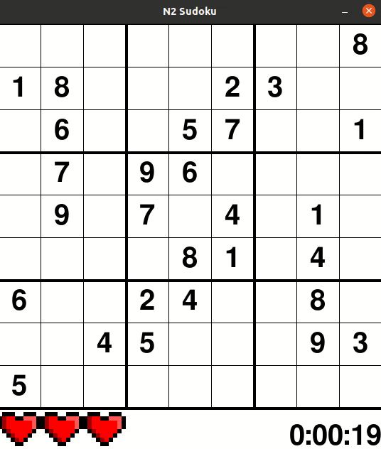
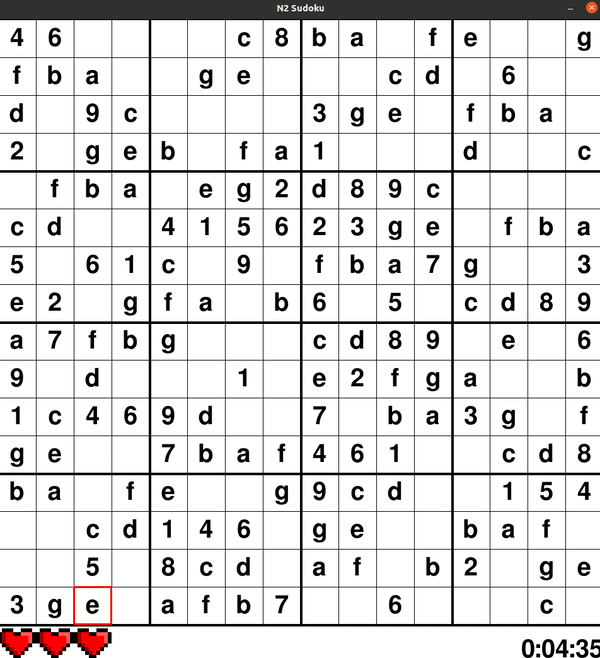

# General N2 Sudoku Game
This is a general N2 sudoku game built using pygames, where N > 1. This implementation can be run up to N = 5, but can easily be extended.

Improved from [here](https://github.com/techwithtim/Sudoku-GUI-Solver).

## How to use
Install `pygame`. If you're using `pip`, run `pip install pygame`.

Download the whole repository and run `game.py`.

To run your own map, just change out `board_.csv` with your code, and change the mode in `game.py`.

## Controls
Input       - 1 to 9, and then a to z and beyond according to ASCII sequence, depending on the selected mode.

Return      - Check selected field

Space       - Solve

## 9x9 Game in action

## 16x16 Game in action

